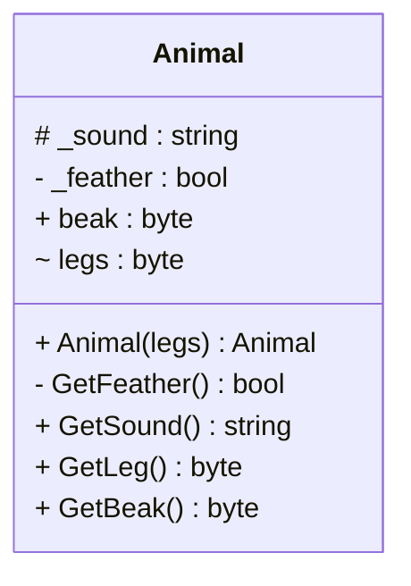

# Kode
Mermaid kode for klassediagram. En klasse med access modifier
<div class="flex flex-col items-center h-full">


```{mermaid}
classDiagram
    class Animal{
        # _sound : string
        - _feather : bool
        + beak : byte
        ~ legs : byte

        + Animal(legs) : void
        - GetFeather() : bool
        + GetSound() : string
        + GetLeg() : byte
        + GetBeak() : byte
    }
```


Public: Alle har adgang \
Private: Kun en selv har adgang \
Protected: Kun sig selv og børn har adgang \
Internal: Kun projektet har adgang

</div>

::right::

# Diagram
Diagrammet for klassediagram. En klasse med access modifier
<div class="flex flex-col items-center h-full">




</div>
