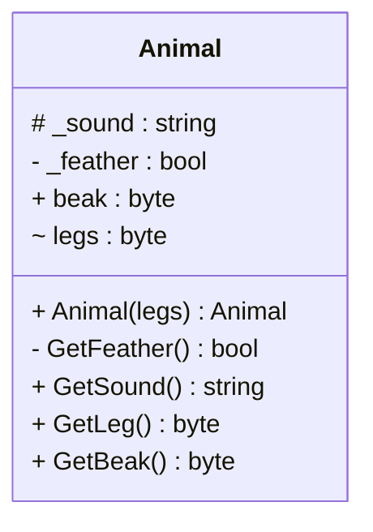

# Kode
For fuld implementering se koden fra github

<div class="flex flex-col items-center h-full">

```c#
class Animal // Class animal {}
{
    protected string _sound; // # _sound : string
    private bool _feather; // - _feather : bool
    public byte beak; //  + beak : byte
    internal byte _legs; // ~ legs : byte

    public Animal(byte legs) // + Animal(legs) : void
    {
        _sound = "Quack"; 
        _feather = false;
        beak = 1; 
        _legs = legs;
    } 

    private bool GetFeather() { } // - GetFeather() : bool
    public string GetSound() { } // + GetSound() : string
    public byte GetLeg()   { } //  + GetLeg() : byte
    public byte GetBeak() { } // + GetBeak() : byte
}
```

</div>

::right::

# Diagram
For Mermaid kode se tidligere slide og/eller GitHub
<div class="flex flex-col items-center h-full">



</div>