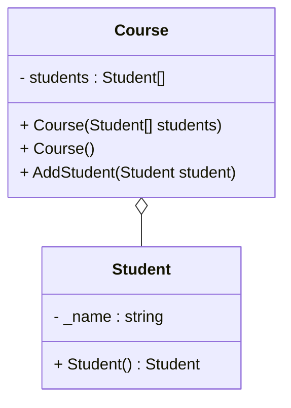

# Aggregation

::left:: 
Se program kode i github under code 

```ts {all|4-7}
class Course
{
    Student[] students = new Student[25]; 
    public Course(Student[] students)
    {
        this.students = students;
    }

}

class Student
{
    private string _name = "";
    private byte _age = 0;

    public Student(string name, byte age)
    {
        _name = name;
        _age = age;
    }
}
```


::right::
Se mermaid kode på GitHub ller rå markdown fil. 


<div class="flex flex-col items-center h-full">


</div>