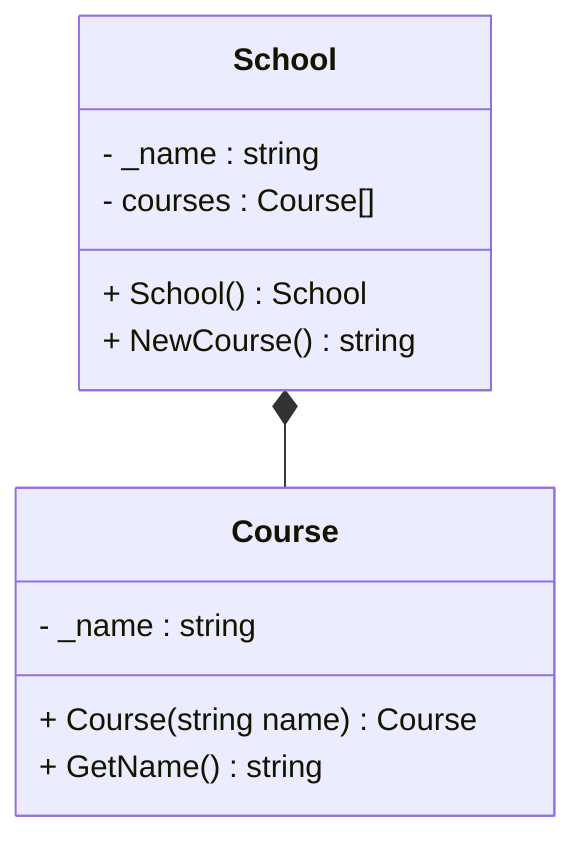

# Composition


::left:: 
Se program kode i github under code 


```ts {all|9}
class School
{
    public string NewCourse(string courseName)
    {
        for (int i = 0; i < _courses.Length; i++)
        {
            if (_courses[i] == null)
            {
                _courses[i] = new Course("Course " + courseName);
                return _courses[i].GetName();
            }
        }
        return null; // No more courses can be added
    }
}

class Course
{
    private string _name; 
    public Course(string name){}
    public string GetName(){}
}
```


::right::
Se mermaid kode på GitHub. 

<div class="flex flex-col items-center h-full">




</div>
