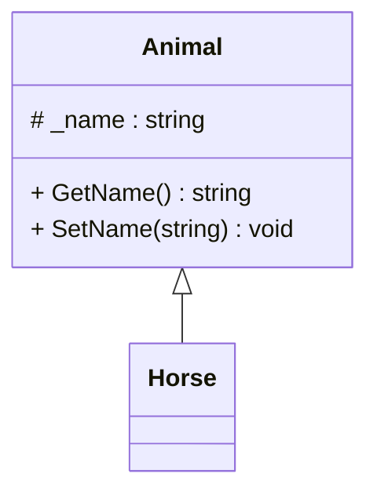

# Inheritance/Generalization


::left:: 
Se program kode i github under code 


```ts {all|15}
class Animal
{
    protected string _name = "";

    public string GetName()
    {
        return _name;
    }
    public void SetName(string name)
    {
        _name = name;
    }
}

class Horse : Animal
{

}

```


::right::
Se mermaid kode på GitHub ller rå markdown fil. 

<div class="flex flex-col items-center h-full">


</div>