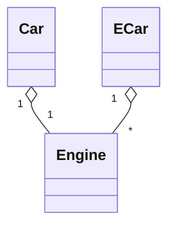

# Multiplicity

```ts {9|19}
class Engine
{
    public string Model { get; set; }
    public Engine(string model) { Model = model; }
}

class Car
{
    private Engine _engine;
    
    public ACar(Engine engine)
    {
        _engine = engine;
    }
}

class ECar
{
    private Engine[] _engines;
    
    public ECar(Engine[] engines)
    {
        _engines = engines;
    }
}
```

::right::


<div class="flex flex-col justify-center items-center h-full">



</div>