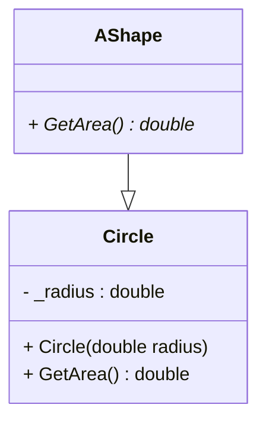

# Realization - abstract
    is-a relation. En abstrakt klasse kan indeholde metoder med implementation og abstract. 
    
::left:: 
Se program kode i github under code 


```ts {all|1-4|1-6|3,15}
    abstract class AShape
    {
        public abstract double GetArea(); // Child handle implementation
    }

    class Circle : AShape
    {
        private double _radius;

        public Circle(double radius)
        {
            _radius = radius;
        }

        public override double GetArea() // Override the parent method
        {
            return Math.PI * _radius * _radius;
        }
    }
```


::right::
Se mermaid kode på GitHub

<div class="flex flex-col items-center h-full">


</div>