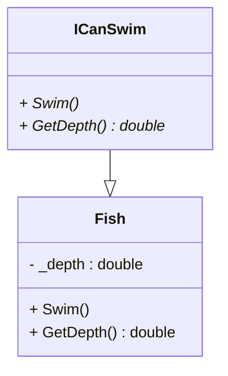

# Realization - interface
    can-do relation. En interface definere en kontrakt. 


::left:: 
Se program kode i github under code 


```ts {all|1-5|1,6|3,9-13}
    interface ICanSwim
    {
        void Swim();
        double GetDepth();
    }
    class Fish : ICanSwim
    {
        private double _depth;
        public void Swim()
        {
            Console.WriteLine("Fish is swimming!");
            Console.WriteLine("Splash splash");
        }
        public double GetDepth() 
        {
            return _depth;
        }
    }
```


::right::
Se mermaid kode på GitHub

<div class="flex flex-col items-center h-full">


</div>