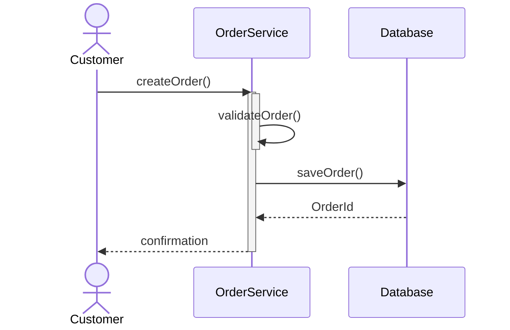
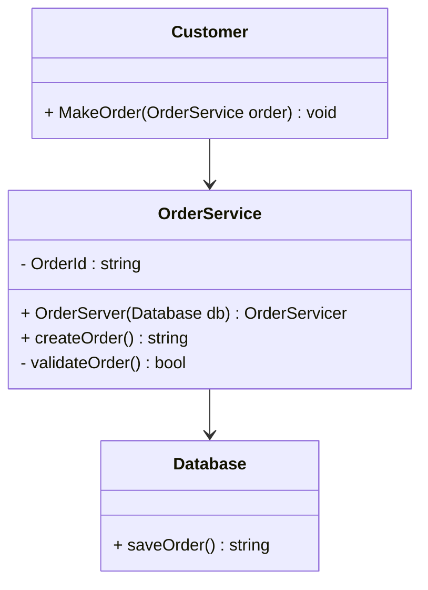
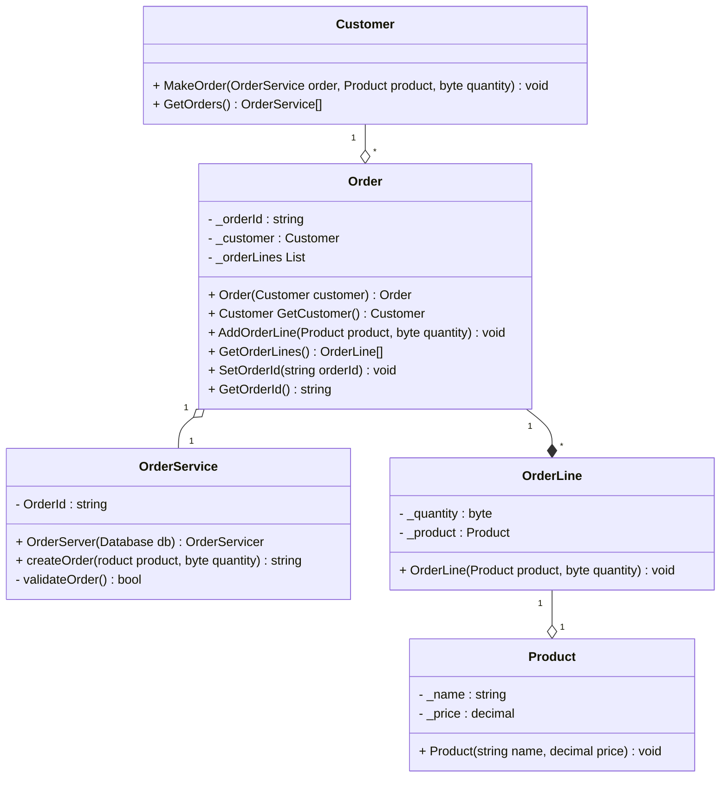
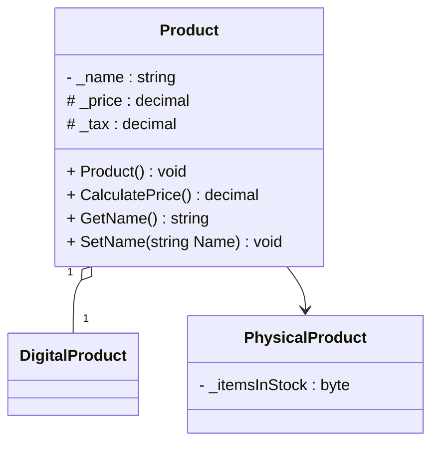
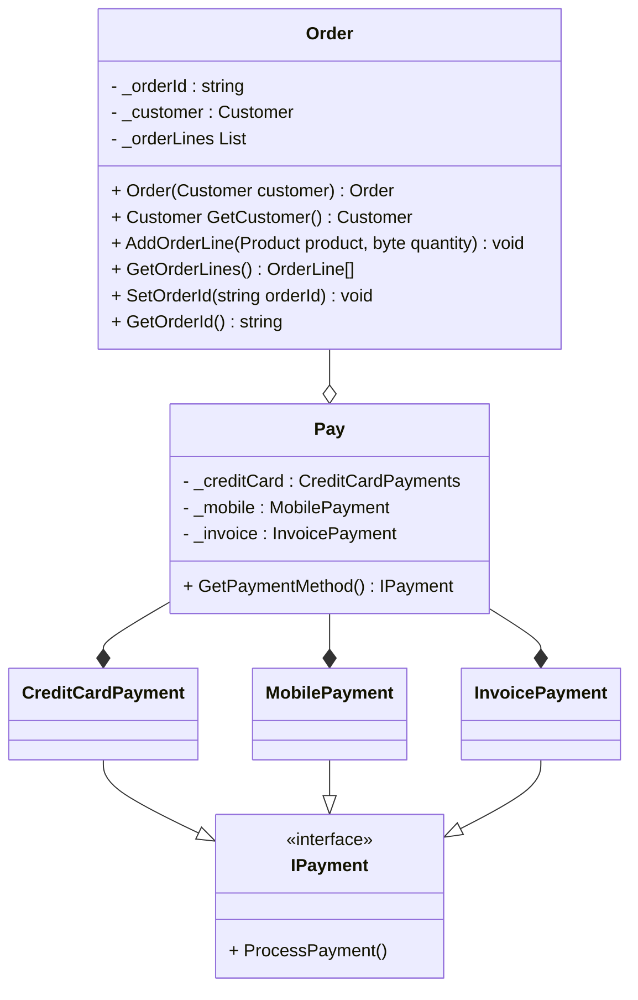

# Opgave 1 – Fra Sekvens til Klasse

I får følgende beskrivelse fra et sekvensdiagram:

- User kalder createOrder()

- OrderService kalder validateOrder()

- OrderService kalder saveOrder() i Database

- Database returnerer OrderId

## Opgave

1) Identificér hvilke klasser der skal eksistere \
OrderService, Database, Customer
1) Identificér hvilke metoder der skal være i hver klasse \
OrderService: validateOrder, createOrder. \
Database: saveOrder 
1) Tegn et simpelt klassediagram i Mermaid

1) Implementér skeleton-klasser i C#

se program.cs

# Opgave 2 – Relationer

Udvid systemet:

- En Order har én Customer
- En Customer kan have mange Order
- En Order indeholder flere OrderLine
- En OrderLine indeholder ét Product

## Opgave

Identificér relationstyper:

1) Association?

1) Aggregation?

1) Composition?

Tilføj multiplicity korrekt

1) Tegn opdateret klassediagram i Mermaid

1) Implementér relationerne i C#

# Opgave 3 – Generalization & Realization

Udvid domænet: \
Product kan være:
- PhysicalProduct
- DigitalProduct

Begge skal kunne:

- CalculatePrice()

Ekstra krav:

Digitale produkter har ingen lagerstatus
Fysiske produkter har lagerantal

## Opgave

1) Brug nedarvning korrekt

1) Brug abstrakt klasse eller interface (argumentér for valg). \
Abstrakt klasse, da PhysicalProduct og DigitalProduct har en is-a relation til den abstrakte klasse AProduct. De har ikke en can-do relation til den abstrakte klasse. Så skal de begge to kunne lave en CalculatePrice(), som har samme beregningsgrundlag, men værdierne er forskellige fra de to. 

1) Tegn klassediagram med generalization/realization

1) Implementér i C# \
Se koden.

# Opgave 4 – Samlet Model + Designovervejelse

::left::

Tilføj betalingssystem:

1) En Order skal kunne betales

Der findes:

- CreditCardPayment

- MobilePayment

- InvoicePayment

Krav:

1) Alle betalingstyper skal implementere ProcessPayment()

1) Order må ikke kende til konkrete betalingstyper

1) Systemet skal kunne udvides med nye betalingstyper uden at ændre Order

## Opgave

1) Design relationen korrekt (interface eller abstract?) \
Interface da relationen vil være can-do til interfacet. Implementering er også specifik til de enkelte metoder. 

1) Tegn komplet klassediagram med:

    1) Relationer

    1) Multiplicity

    1) Generalization

    1) Realization

1) Implementér designet i C#

Argumentér kort:

- Hvilke OOP-søjler bruges?

- Hvis man laver det forkert, hvilke OOP søjler bryder man så ?
