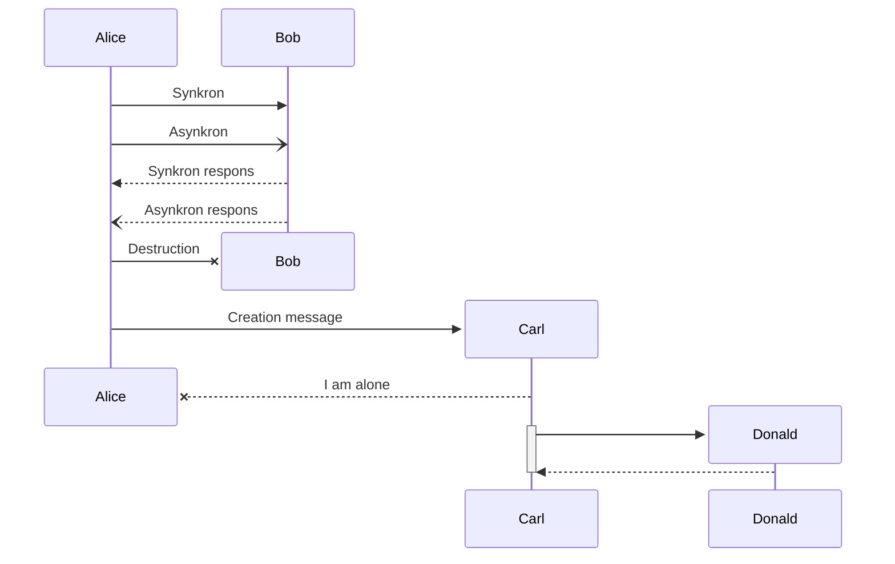

# Code & Diagram Side by Side

**Kode:**

```mermaid
sequenceDiagram

Alice ->> Bob : Synkron
Alice -) Bob : Asynkron
Bob -->> Alice : Synkron respons
Bob --) Alice : Asynkron respons
destroy Bob
Alice -x Bob : Destruction
create participant Carl
Alice ->> Carl : Creation message
destroy Alice
Carl --x Alice : I am alone
activate Carl
create participant Donald
Carl ->> Donald :
Donald -->> Carl:  
deactivate Carl

```

**Diagram:**

```mermaid {scale: 0.5}
sequenceDiagram

Alice ->> Bob : Synkron
Alice -) Bob : Asynkron
Bob -->> Alice : Synkron respons
Bob --) Alice : Asynkron respons
destroy Bob
Alice -x Bob : Destruction
create participant Carl
Alice ->> Carl : Creation message
destroy Alice
Carl --x Alice : I am alone
activate Carl
create participant Donald
Carl ->> Donald :
Donald -->> Carl:  
deactivate Carl

```

