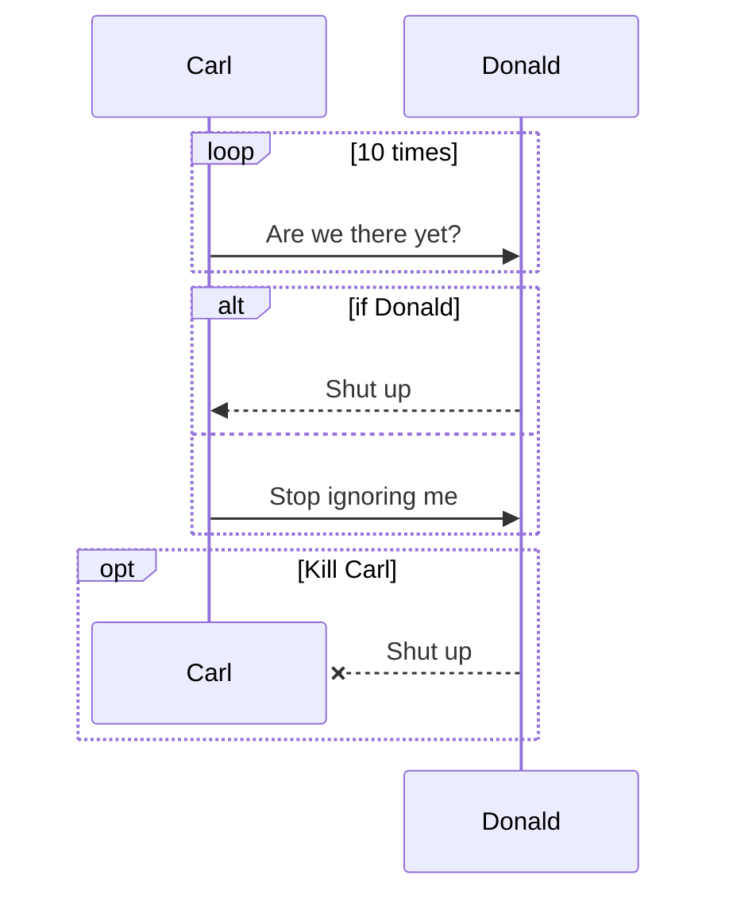

# Example

```mermaid {scale: 0.75}
sequenceDiagram

loop 10 times
    Carl ->> Donald : Are we there yet?
end

alt if Donald
    Donald -->> Carl : Shut up
else
    Carl ->> Donald : Stop ignoring me
end

opt Kill Carl
    destroy Carl
    Donald --x Carl : Shut up
end
```

```mermaid
sequenceDiagram

loop 10 times
    Carl ->> Donald : Are we there yet?
end

alt if Donald
    Donald -->> Carl : Shut up
else
    Carl ->> Donald : Stop ignoring me
end

opt Kill Carl
    destroy Carl
    Donald --x Carl : Shut up
end
```

