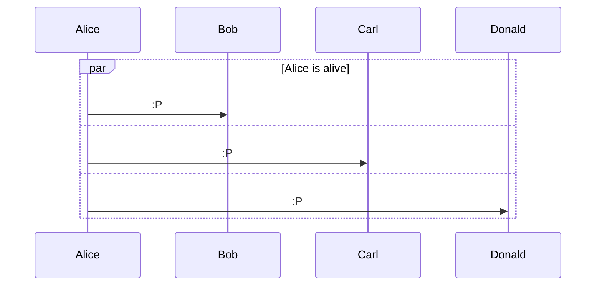

# Another example

<div grid="~ cols-2 gap-4" m="t-2">

<div>


</div>
<div>

```{mermaid}
sequenceDiagram

par Alice is alive
    Alice ->> Bob : :P 
and
    Alice ->> Carl : :P
and
    Alice ->> Donald : :P
end  

```
</div>
</div>

Meget mere syntax på mermaid officielle hjemmeside. 