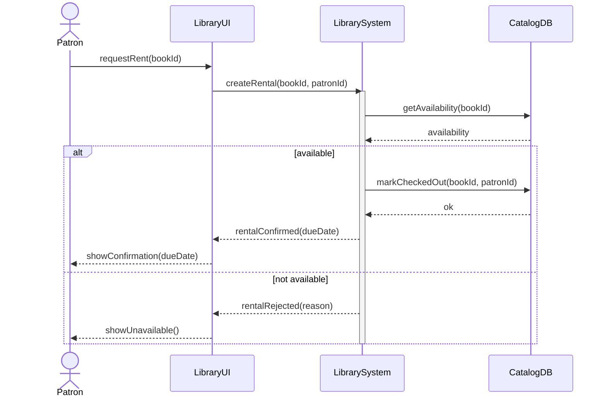

## SD

```mermaid {scale: 0.5}
sequenceDiagram
actor Patron
participant LibraryUI
participant LibrarySystem
participant CatalogDB

Patron ->> LibraryUI : requestRent(bookId)
LibraryUI ->> LibrarySystem : createRental(bookId, patronId)
activate LibrarySystem
LibrarySystem ->> CatalogDB : getAvailability(bookId)
CatalogDB -->> LibrarySystem : availability

alt available
    LibrarySystem ->> CatalogDB : markCheckedOut(bookId, patronId)
    CatalogDB -->> LibrarySystem : ok
    LibrarySystem -->> LibraryUI : rentalConfirmed(dueDate)
    LibraryUI -->> Patron : showConfirmation(dueDate)
else not available
    LibrarySystem -->> LibraryUI : rentalRejected(reason)
    LibraryUI -->> Patron : showUnavailable()
end
    deactivate LibrarySystem

```
