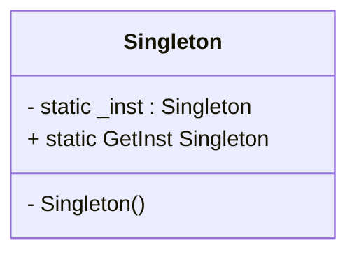

# Korrekt Løsning

::left::

## Kode

```ts{all|3|3,5|10-17}
class Singleton
{
    private static Singleton _inst = null;

    private Singleton()
    {

    }

    public static Singleton GetInst()
    {
        if ( _inst == null)
        {
            _inst = new Singleton();
        }
        return _inst;
    }
}
```
::right::

## Klassediagram

