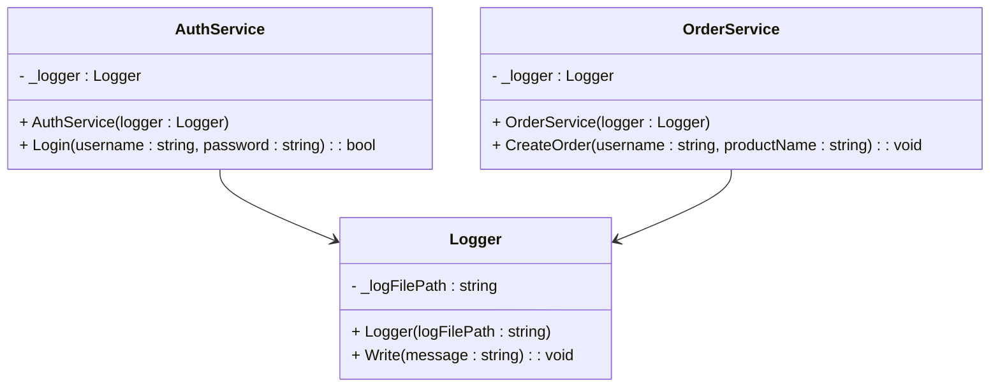

## Opgave 1

Udvid koden med en Singleton - findes på github under solution.

1) Færdiggør klassediagram ved at tilføje Singleton.

1) Lav rettelser i koden, så alle services bruger samme logger-instans, og der skrives til logfilen.

