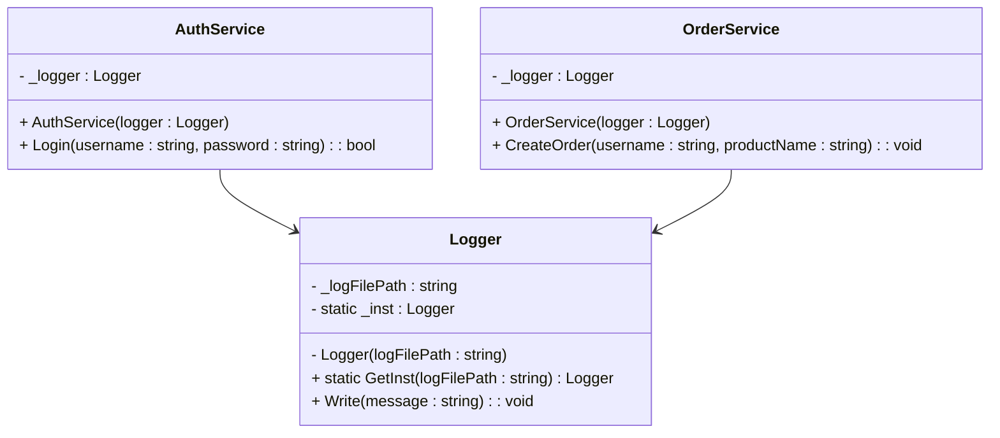

```mermaid
classDiagram
    class Logger {
        - _logFilePath : string
        - static _inst : Logger
        - Logger(logFilePath : string)
        + static GetInst(logFilePath : string) Logger
        + Write(message : string) : void
    }

    class AuthService {
        - _logger : Logger
        + AuthService(logger : Logger)
        + Login(username : string, password : string) : bool
    }

    class OrderService {
        - _logger : Logger
        + OrderService(logger : Logger)
        + CreateOrder(username : string, productName : string) : void
    }

    AuthService --> Logger
    OrderService --> Logger
```