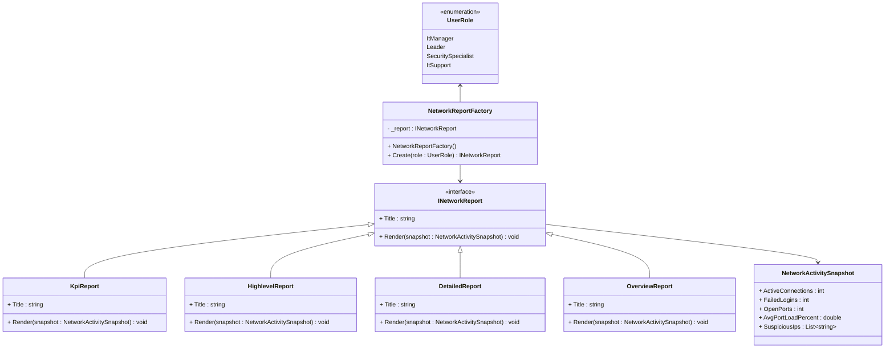

```mermaid
    classDiagram

    class NetworkReportFactory {
        - _report : INetworkReport
        + NetworkReportFactory() 
        + Create(role : UserRole) INetworkReport
    }

    class UserRole {
        <<enumeration>>
        ItManager
        Leader
        SecuritySpecialist
        ItSupport
    }

    class INetworkReport {
        <<interface>>
        + Title : string
        + Render(snapshot : NetworkActivitySnapshot) void
    }

    class NetworkActivitySnapshot {
        + ActiveConnections : int
        + FailedLogins : int
        + OpenPorts : int
        + AvgPortLoadPercent : double
        + SuspiciousIps : List~string~
    }

    class KpiReport {
        + Title : string
        + Render(snapshot : NetworkActivitySnapshot) void
    }

    class HighlevelReport {
        + Title : string
        + Render(snapshot : NetworkActivitySnapshot) void
    }

    class DetailedReport {
        + Title : string
        + Render(snapshot : NetworkActivitySnapshot) void
    }

    class OverviewReport {
        + Title : string
        + Render(snapshot : NetworkActivitySnapshot) void
    }

    UserRole <-- NetworkReportFactory
    NetworkReportFactory --> INetworkReport


    INetworkReport <|-- KpiReport
    INetworkReport <|-- HighlevelReport
    INetworkReport <|-- DetailedReport
    INetworkReport <|-- OverviewReport


    INetworkReport --> NetworkActivitySnapshot
```