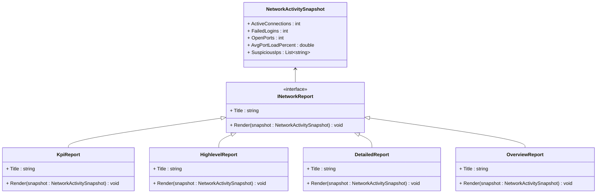

# Løsning

```mermaid
classDiagram
    direction TB


    class INetworkReport {
        <<interface>>
        + Title : string
        + Render(snapshot : NetworkActivitySnapshot) void
    }

    class NetworkActivitySnapshot {
        + ActiveConnections : int
        + FailedLogins : int
        + OpenPorts : int
        + AvgPortLoadPercent : double
        + SuspiciousIps : List~string~
    }

    class KpiReport {
        + Title : string
        + Render(snapshot : NetworkActivitySnapshot) void
    }

    class HighlevelReport {
        + Title : string
        + Render(snapshot : NetworkActivitySnapshot) void
    }

    class DetailedReport {
        + Title : string
        + Render(snapshot : NetworkActivitySnapshot) void
    }

    class OverviewReport {
        + Title : string
        + Render(snapshot : NetworkActivitySnapshot) void
    }

    NetworkActivitySnapshot <-- INetworkReport

    INetworkReport <|-- KpiReport
    INetworkReport <|-- HighlevelReport
    INetworkReport <|-- DetailedReport
    INetworkReport <|-- OverviewReport


```
