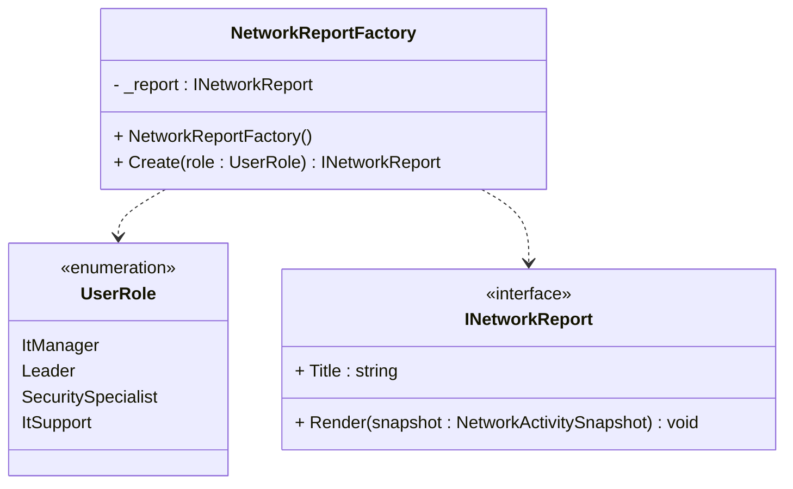

# Løsning

## Diagram

::left::


::right:: 

## Kode

```ts
class NetworkReportFactory
{
    public INetworkReport Create(UserRole role)
    {
        switch (role)
        {
            case UserRole.ItManager: 
                _report = new ITManagerReport();
                break;
            case UserRole.Leader:
                _report = new LeaderReport();
                break;
            case UserRole.SecuritySpecialist:
                _report = new SecuritySpecialistReport();
                break;
            case UserRole.ItSupport:
                _report = new ItSupportReport();
                break;
        }
        return _report;
    }
}

```