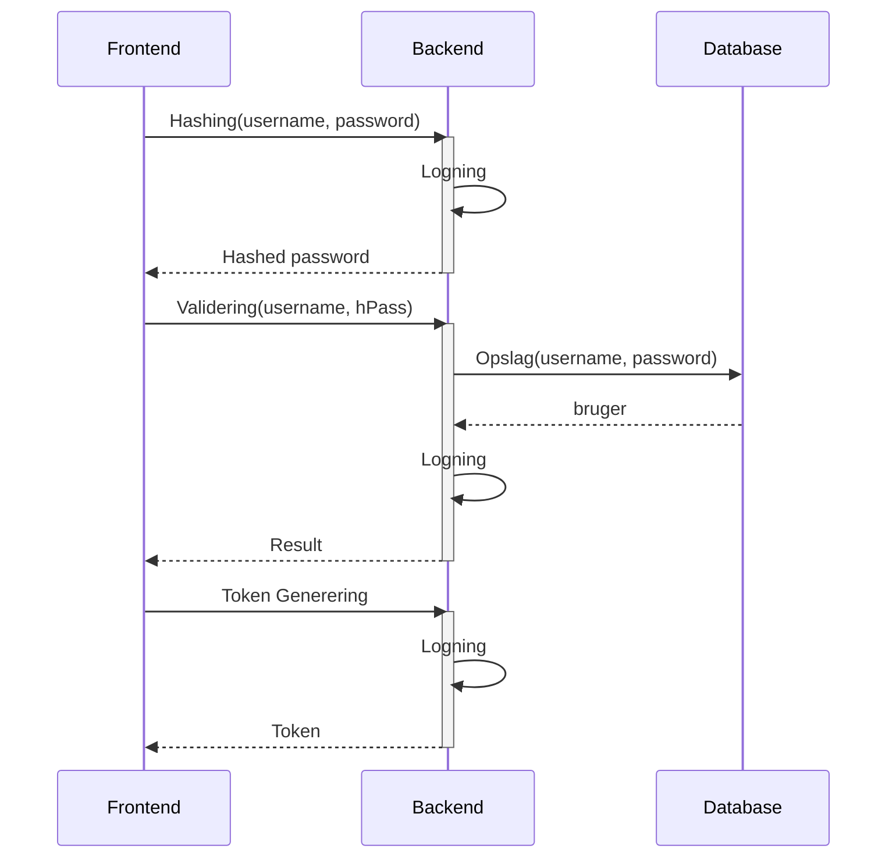

# Behovet

::left::

## Løsningsforslag

::right::

## Problemet

Problemer med denne tilgang
- Stærk kobling mellem frontend og validering. 
- Hvis der er noget som skal ændres, kræver det mange tilpasninger. 
- Security issue, hvis udstiller kontinuerlig data på vores kommunikations linje. 
