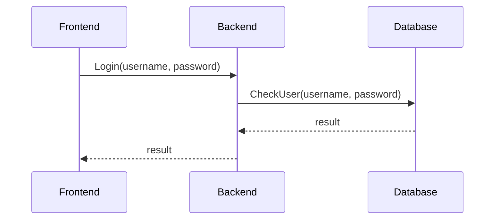

# Behovet

::left::

## Behov
Vi ønsker:
- Én simpel indgang
- Intern kompleksitet skjules
- Tydeligt interface

Hvis vi kan lave noget ligende:

::right::
<v-click>

Så skjuler vi kompleksitet, og skaber et tydeligt interface. 

</v-click>