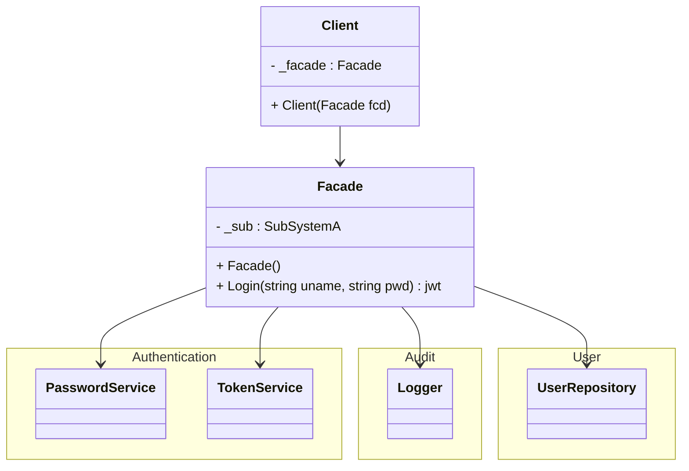

# Løsning

::left::

## Kode

```ts

class Client
{
     // See implementation in GitHub - save space
}

class Facade
{
    private SubSystemA? _sub = null;
    PasswordService
    UserRepository
    TokenService
    Logger
    
    public jwt Login(string uname, string pwd)
    {
        string hPwd = _sub.Hash(password);
        User usr = _sub.Validate(uname, hPwd);
        jwt token = _sub.Token(usr)
        return token;
    }
}

namespace SubSystem;
class SubSystemA
{
    // See implementation in GitHub - save space
}


```


::right::

## Diagram


