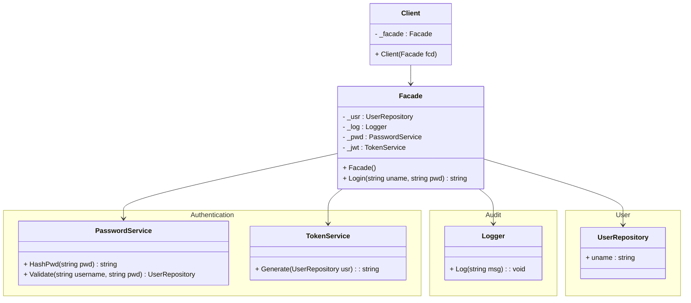

# Løsning

## Diagram

```mermaid
classDiagram
    direction TB
    class Client{
        - _facade : Facade
        + Client(Facade fcd)
    }

    class Facade{
        - _usr : UserRepository
        - _log : Logger
        - _pwd : PasswordService
        - _jwt : TokenService

        + Facade()
        + Login(string uname, string pwd) string
    }


    namespace Authentication{
        class PasswordService{
            + HashPwd(string pwd) string
            + Validate(string username, string pwd) UserRepository
        }
        class TokenService{
            + Generate(UserRepository usr) : string
        }
    }

    namespace Audit{
        class Logger{
            + Log(string msg) : void
        }
    }


    namespace User{
        class UserRepository{
            + uname : string
        }
    }

    Client --> Facade
    Facade --> PasswordService
    Facade --> UserRepository
    Facade --> TokenService
    Facade --> Logger

```
