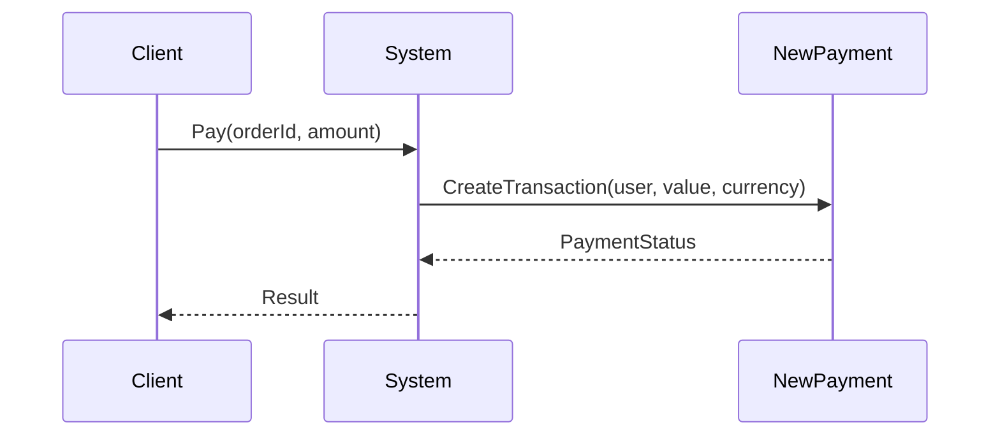

# Behovet

::left::

## Løsningsforslag

::right::

## Problemet
- Du må ikke ændre eksternt system
- Du vil ikke ændre hele dit system
- Du skal få dem til at tale sammen

<v-click>

## Behov
Vi ønsker:
- At oversætte mellem to interfaces
- Uden at ændre eksisterende kode
- Uden at sprede tilpasningskode overalt
</v-click>