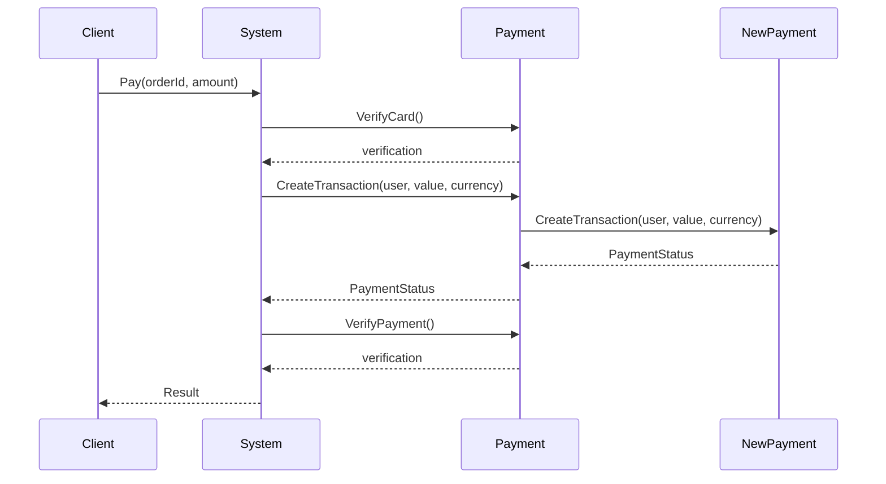

# Løsning

## Sequence Diagram

```mermaid{scale:0.6}
sequenceDiagram
    participant Client
    participant System
    participant Payment

    Client ->> System : Pay(orderId, amount)
    System ->> Payment : VerifyCard()
    Payment -->> System : verification
    System ->> Payment : CreateTransaction(user, value, currency)
    Payment ->> NewPayment : CreateTransaction(user, value, currency)
    NewPayment -->> Payment : PaymentStatus
    Payment -->> System : PaymentStatus
    System ->> Payment : VerifyPayment()
    Payment -->> System : verification
    System -->> Client : Result
```