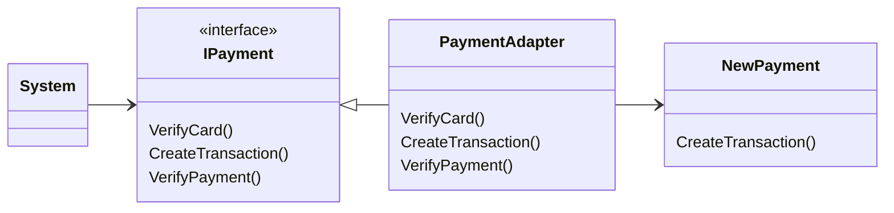

# Løsning

## Class Diagram

```mermaid
classDiagram
direction LR
    class IPayment{
        <<interface>>
        VerifyCard()
        CreateTransaction()
        VerifyPayment()
    }

    class PaymentAdapter{
        VerifyCard()
        CreateTransaction()
        VerifyPayment()
    }

    class NewPayment{
        CreateTransaction()
    }

    System --> IPayment
    IPayment <|--PaymentAdapter
    PaymentAdapter --> NewPayment
```