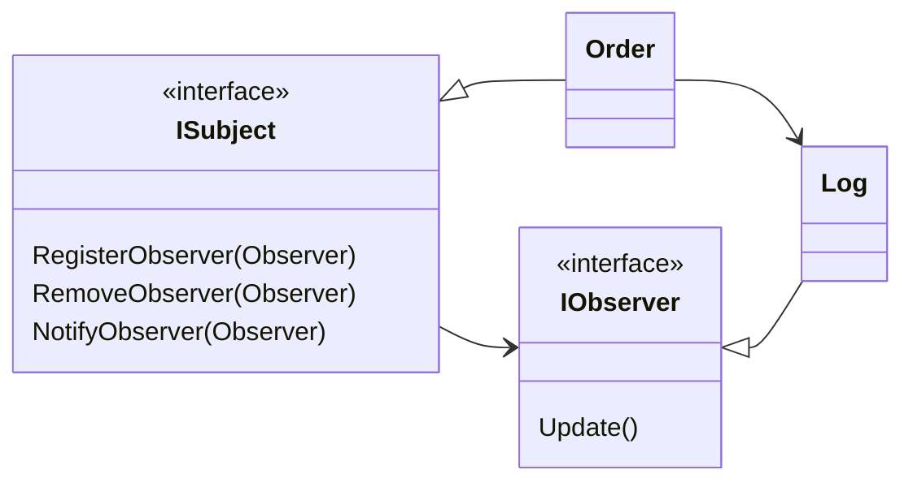

# Løsning

::left::

## Diagram


::right::

## Kode

```ts {all|1-7|12-15|17}
IObserver[] observers = new IObserver[]
{
    new Log(), 
    new Ui(), 
    new Mail(), 
    new Stock()
};

ISubject order = new Order();

Console.WriteLine("Register Observers");
foreach (IObserver observer in observers)
{
    order.RegisterObserver(observer);
}
Console.WriteLine("Order change");
order.ChangeState("With currier");

```