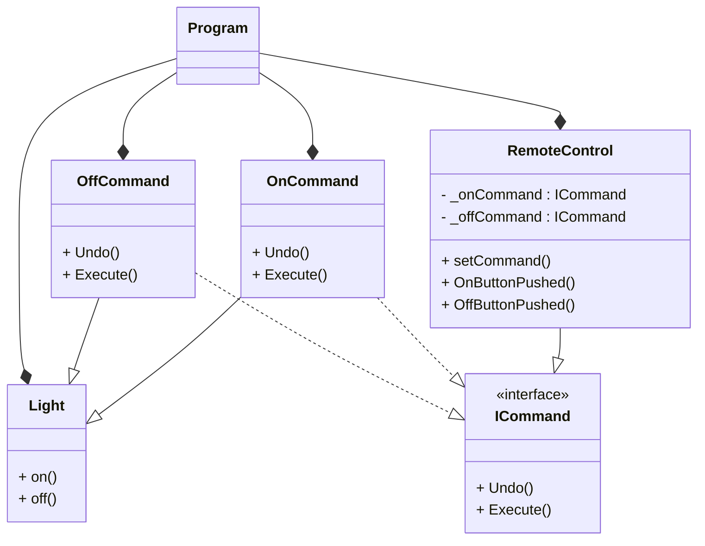

```mermaid 
classDiagram
    class Program{

    }

    class Light{
        + on()
        + off()
    }

    class RemoteControl{
        - _onCommand : ICommand
        - _offCommand : ICommand
        + setCommand()
        + OnButtonPushed()
        + OffButtonPushed()
    }

    class ICommand{
        <<interface>>
        + Undo()
        + Execute()
    }

    class OnCommand{
        + Undo()
        + Execute()
    }

    class OffCommand{
        + Undo()
        + Execute()
    }

    RemoteControl --|> ICommand
    OnCommand ..|> ICommand
    OnCommand --|> Light
    OffCommand ..|> ICommand
    OffCommand --|> Light
    Program --* Light
    Program --* OnCommand
    Program --* OffCommand
    Program --* RemoteControl

```