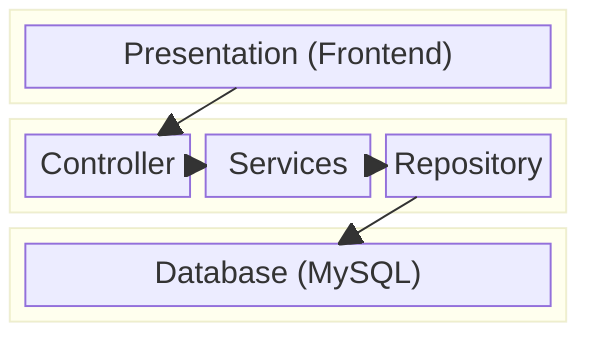

# Layered Arkitektur

Layered - eller tier arkitektur - er en måde at opbygge systemer. 
::right::

::left::

## Presentation
Alt der fremvises for bruger. 
HTML/CSS/JS - altså webteknologi faget. 

## Applikation
Her ligger programmets logik – hvad systemet skal gøre.

## Data
Alt der har med data at gøre – f.eks. databasen.
Det vi skal bruge resten af semester på. 
