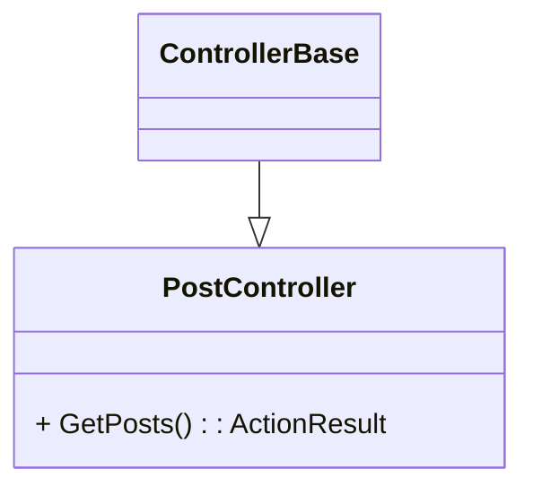

# Hvad er en controller

Controller, er en klasse vi definere i C# som bliver konverteret til et API. 

::left::

1) dotnet new webapi
1) mkdir controllers
1) touch controllers/PostController.cs
1) code .





::right::

```ts{1-2,5|3|all}
[ApiController]
[Route("api/posts")]
class PostController : ControllerBase
{
    [HttpGet]
    public ActionResult<Post[]> GetPosts()
    {
        return Ok(service.AllPosts())
    }
}

```