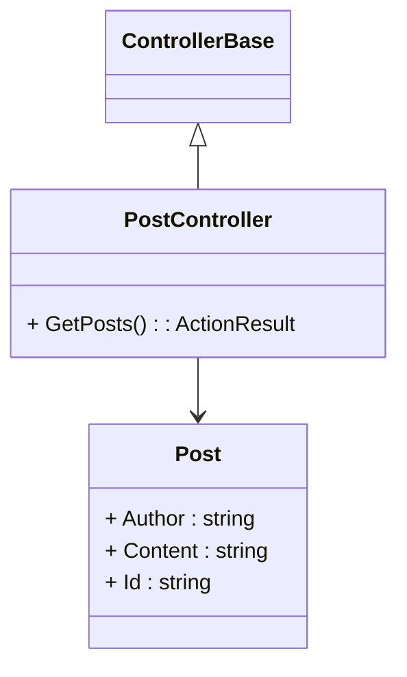

# DTO

DTO - Data Transfer Objekt. 
Det er objekter vi laver for at flytte data ind og ud af vores systemet. 

Der kan være både request og respons DTO - afhænger af situationen. 

::left::


::right::

```ts
class Post
{
    public string Author {set; get;} = string.empty;
    public string Content {set; get;} = string.empty;
    public string Id {set; get;} = string.empty;
}

class PostService
{
    private Dictionary<string, Post> _posts = new Dictionary<string, Post>();

    public Dictionary<string, Post> GetPosts()
    {
        return _posts;
    }
}

```