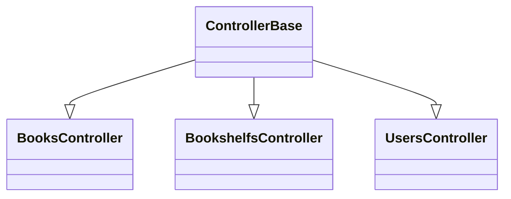
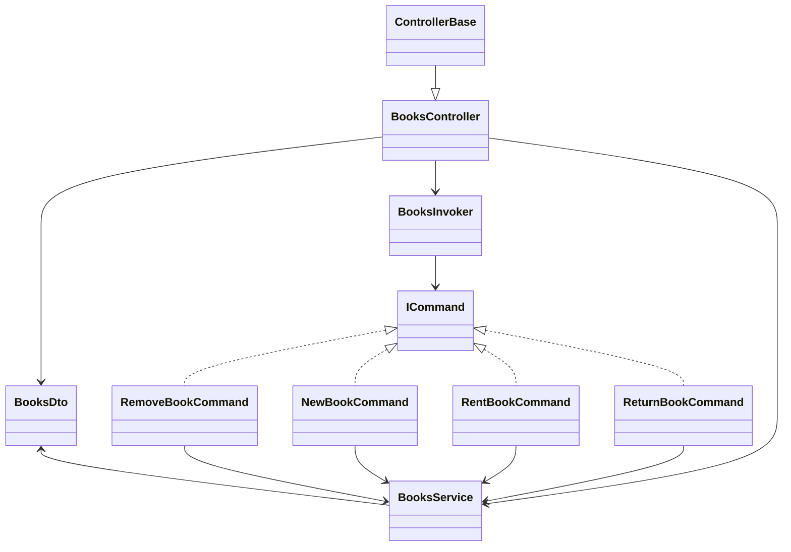
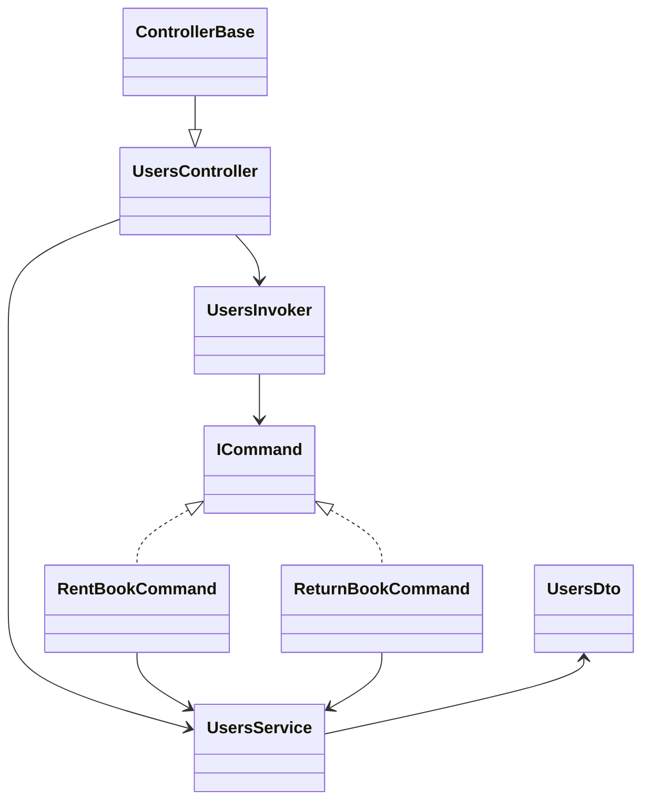
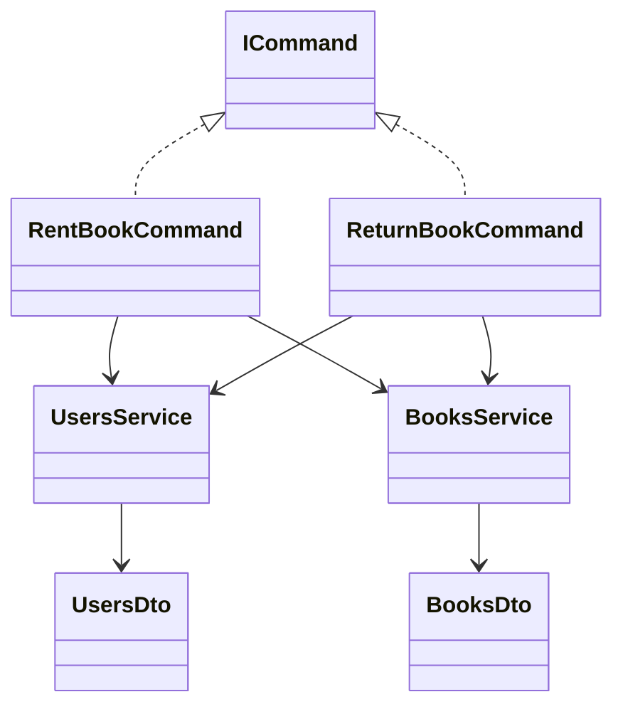
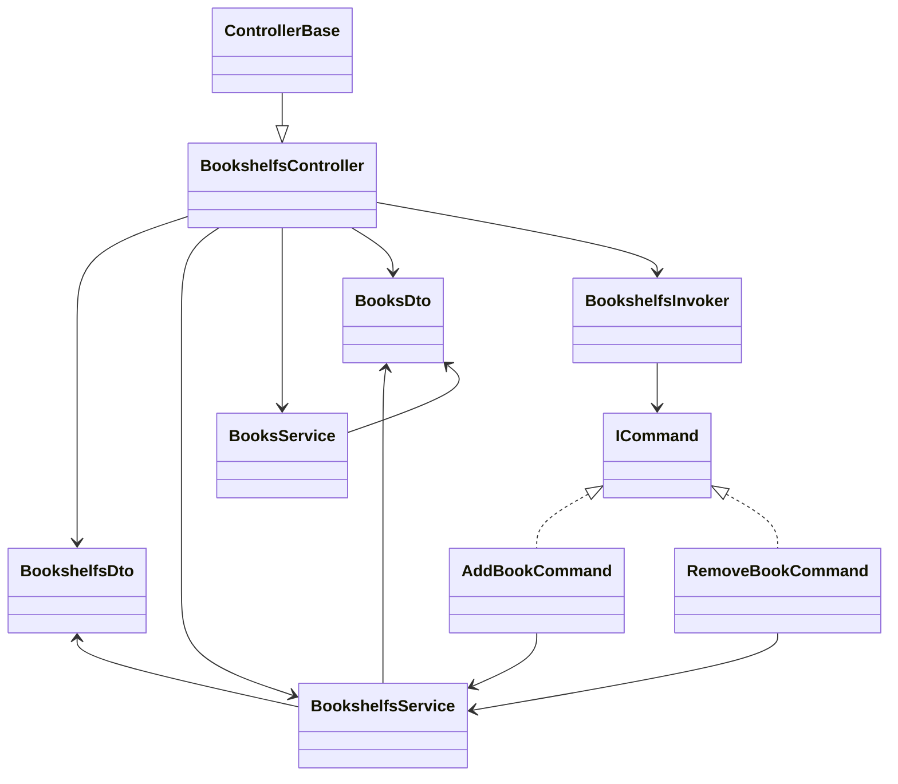

# Controller Diagram

The following diagram shows the inheritance for the controllers. 

# Books Diagram

The Books diagram shows the relationship between books and the different commands connected to them.

This is an example of the Command design pattern, where:

1) Invoker -> Controller: Gets Assigned
1) Receiver -> Service: responsible for the logic
1) Action -> Commands: responsible for defining the available commands

A useful reflection is: who is the client, and why?

The controller knows about the available actions, but because of polymorphism it only needs to know the ICommand interface. The client is therefore the part of the system responsible for assigning the concrete commands.
Also note that this example is to keep responsible where it belongs. 

# Users Diagram

The Users diagram resembles the Books diagram, but an important point is that both users and books have knowledge about the rent and return commands.

# Rental Diagram

To illustrate the point made in the Users diagram, the complete rental diagram is shown here.

It becomes clear that the commands are responsible for activating the concrete logic in both UsersService and BooksService when handling rental and return.

# Bookshelfs Diagram

The same overall idea as in the Books diagram applies here: this is also modeled using the Command pattern.

