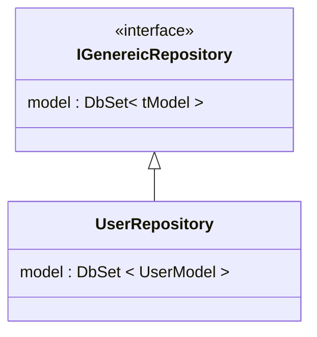

# Repository

Endnu et design pattern :D 

::left::



::right::

```ts{1,8|3,12}
public interface IGenericRepositories<tModel> where tModel : class
    {
        void Add(tModel model);
        tModel? GetById(byte modelId);
        void Remove(byte modelId);
    }

public class UserRepository : IGenericRepositories<UserModel>
    {
        private readonly UserContext _userContext;
        public UserRepository(UserContext userContext){}
        public void Add(UserModel model){}
        public UserModel? GetById(byte modelId){ }
        public void Remove(byte modelId){}
    }

```