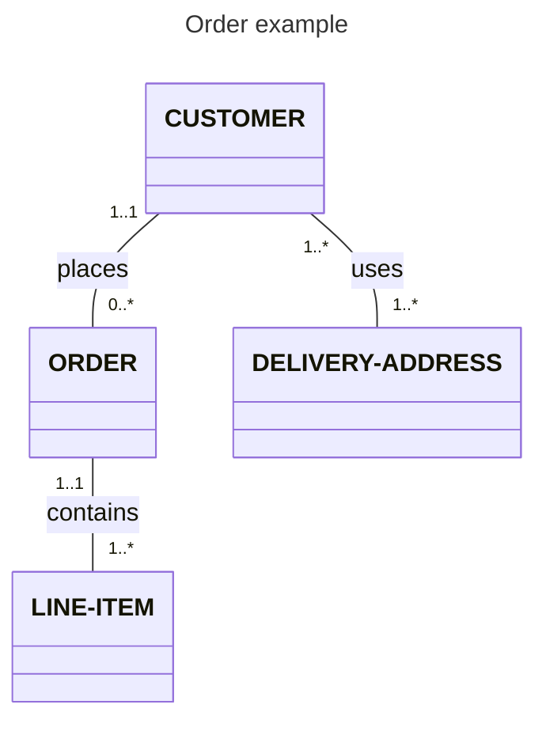

# Er Recap

1) Entities - tabel \
rektangulær - navneord med store bogstaver \
CUSTOMER

1) Attributer
1) Relationer

```mermaid 
---
title: Order example
---
classDiagram
CUSTOMER "1..1"--"0..*" ORDER : places
ORDER "1..1"--"1..*" LINE-ITEM : contains
CUSTOMER "1..*"--"1..*" DELIVERY-ADDRESS : uses
```